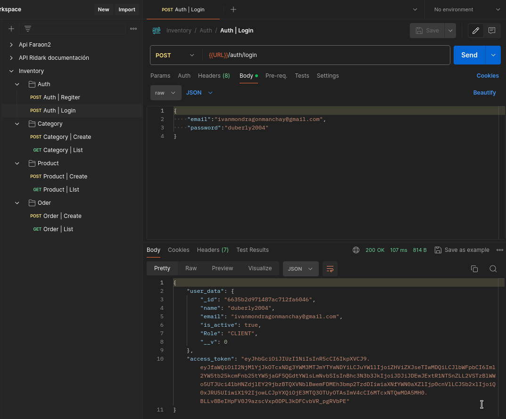

## Backend for project inventory

### Modules
- User
- Auth
- Category
- Product
- Order
### Preview



### Technologies used


<div style="margin-left:20px; display:flex;grid-gap: 30px;">
    <h3>MongoDb</h3>
    <h3>TypeScript</h3>
</div>

- nodejs version 18.20.2
- tsc Version 5.4.4


```bash
git clone https://github.com/Duberly2004/inventory_backend
```

```bash
cd inventory_backend
```

```bash
npm install
```
